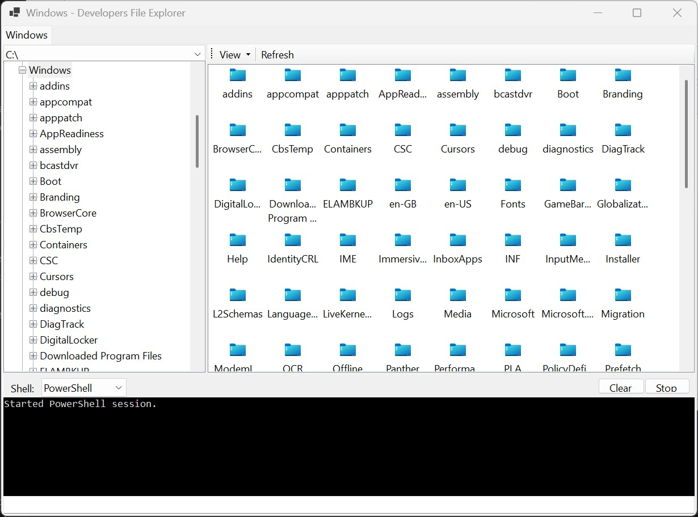

# MyFileExplorer

MyFileExplorer is a Windows Forms file explorer built for developers who want fast folder navigation with a built-in terminal workflow.



## Why this project is useful

- Faster dev navigation: browse folders and run commands in one window.
- Tabbed explorer sessions: keep multiple working directories open at once.
- Session restore: reopen the app and continue where you left off.
- Practical file actions: open, rename, copy, cut, paste, delete, and view properties.
- Multiple folder views: Large Icons, Small Icons, List, Details, and Tiles.
- Keyboard-first flow: shortcuts for tabs, refresh, rename, and common file operations.

## Key features

- Multi-tab explorer UI with right-click tab actions.
- Split layout with:
  - folder source selector and folder tree on the left,
  - folder contents on the right,
  - integrated terminal at the bottom.
- Embedded terminal supports both PowerShell and Command Prompt.
- Terminal working directory syncs with selected folder.
- Per-directory terminal history and persisted terminal output.
- Explorer and terminal session state is persisted under local app data.

## Tech stack

- C#
- .NET `net10.0-windows`
- Windows Forms

## Getting started

### Requirements

- Windows
- .NET SDK with support for `net10.0-windows`

### Run

```bash
dotnet run
```

### Build

```bash
dotnet build
```

## Common shortcuts

- `Ctrl+T`: New tab
- `Ctrl+W`: Close current tab
- `Ctrl+Tab` / `Ctrl+Shift+Tab`: Next or previous tab
- `F5`: Refresh active explorer tab
- `F2`: Rename selected item
- `Del` / `Shift+Del`: Recycle bin delete / permanent delete
- `Ctrl+C`, `Ctrl+X`, `Ctrl+V`: Copy, cut, paste
